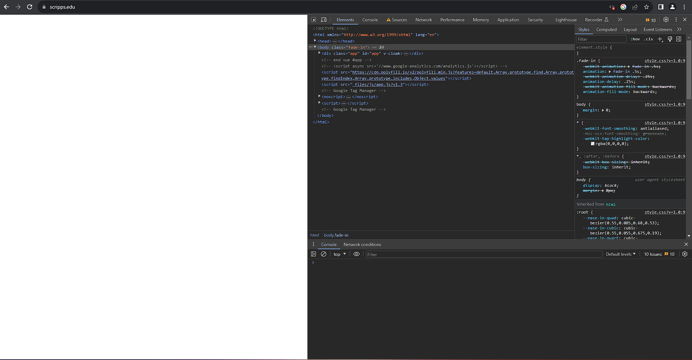
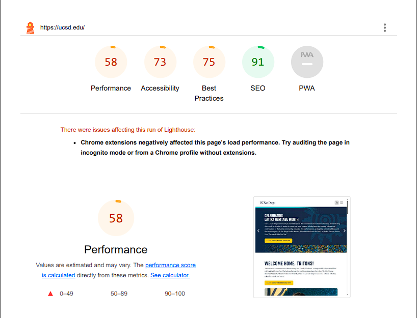

# CSE134B-SS20-HW1
# Name: Tung Nguyen
# PID: A16299886

## Netlify url: 
https://bejewelled-horse-24a844.netlify.app/

## Part 1:
### Question 2:
1) Total number of requests is 27
+ **document**: 1
+ **stylesheet**: 1
+ **png**: 1
+ **jpeg**: 2
+ **gif**: 1
+ **font**: 1
+ **svg + xml**: 17
+ **media**: 1
+ **script**: 1
+ **vnd.microsoft.icon**: 1
2) Total Bytes Sent are 6.7~6.8 Megabytes
3) Named "Waterfall.png" in "Screenshots" folder

### Question 3:

## Part 2:
### Navigating espn.com:
Quite a pain. It took a lot of spamming left/down key to finally get to the Top Headlines section. When I load the page, the screen reader picks the links at the far left of the page by default. Trying to go Top Headlines requires me to traverse down the entire page first then go back up.

### Navigating webaim.org:
Fairly easier than espn.com. I still have to go from left to right. But the page is divided into rows by rows. To elaborate, in each chunk, I go from left to right in that row first before moving on to the next row. This makes it faster to get to the WebAIM Trainings section! ESPN.com on the other hand is divided like column by column, so to get to the right column I have to traverse the left columns first.

## Part 3:
### Question 1:
The uci's response header is more revealing than ucsd's. I am not too sure what is troublesome about these info, but I guess that being able to know beforehand crucial info is an advantage for hackers.\
**ucsd.edu's**:\

**uci.edu's**:\

### Question 2:
**ucsd.edu:**\
2 slideshows are broken. The big one at the top of the page and the one under "Academic" section.\
Screenshot for the second slideshow:\
\
**scripps.com:**\
Disabling javascript will prevent the entire page to load (the entire page is white). All functionalities are assumed broken.\
\
**ucla.edu:**\
Half of the contents on the page no longer load, usually the ones that are updated in real time. The ones that load still have their functionalities intact.\

### Question 3:
**csuci.edu**: Yes, "https://www.csuci.edu/blahh" was used to test its custom 404 page.\
\
**jpcatholic.edu**: No, seems like a default 404 page. "https://jpcatholic.edu/blahh" was used to test for it.\

**Why custom 404 page is a good idea?**\
Because the default 404 page is a barebone deadend. When the user accidentally accesses an invalid page, they will need at least a link to go back to the site's main page. A custom 404 page also helps differentiating the site from other sites.

### Question 4:
Yes, nytime.com has a robots.txt, which can be openly accessed by typing "https://www.nytimes.com/robots.txt" in the URL bar. 

Under the "User-agent: *" section we can see a lot of secret readable links that are disallowed for crawlers. Some of these may be unexpectedly sensitive. Since the public can access these webpages, a well-versed hacker can exploit these pages to their advantage. 

Nytimes.com also excludes some particular dangerous crawlers from its entire site using the "Disallow: /". These bots are:
1) **CCBot**: The bot used to train ChatGPT and leverages Apache Nutch which is a framework used for large scale scalping.
2) **Google-extended**: To block Google's controversial Bard and Vertex AI generative APIs.
3) **GPTBot**: Self-explanatory.
4) **ia_archiver**: An external bot that regularly backups the site's previous contents in case it get wiped. Kind of an Internet historian. Unclear why nytimes.com wants to block it.
5) **omgili/omgilibot**: A crawler based from Israel. Its specific purpose is unknown but since it's from Israel, it is up to no good.
   
### Question 5:
Google hacking, also known as Google Dorking, is an oversight in design that allows advanced search to uncover information that should not be available to the public. Although this is illicit, it is entirely legal. This is possible through the Google Bot, a crawler that will try to index any corner of the site that is not explicitly disallowed. I think that if possible, sensitive information should be kept local on a drive instead of being published to the web. One single oversight will leak out sensitive information and security measures like robots.txt can only do so much. Nytimes.com's abuse of robots.txt is corcerning, instead of the long list of disallows those contents should have not been published to the web in the first place. 

### Question 6:
Querying "Why UCSD is awesome" got me 1,550,000 results in 0.28 second. 

It's near impossible for me to find the 500-510th URLs because to get more results you can only scroll down instead of accessing a specific page of results like in the old days. But I notice that as I scroll down the results become much less relevant, such as "best places to eat near UCSD".

Bing's results are very similar to Google's, but at least Bing gives you page number to choose from at the bottom. Duckduckgo is more barebone than both Bing and Google: Duckduckgo's top results are still relevant but the fewer down quickly become irrelevant, doesn't show total results and page numbers. I think I still prefer Google the most.

### Question 7:
medium.com's java console reveals that they are hiring! This is a pretty cool strategy for unemployed web designers who debug this page on accident.\

**medium.com's local storage:**\
\
Looking at the site's local storage, I'm not sure what half these numbers are for. But I can discern my total visit to this page this month, this week, when was my first visit, my signed in gmail, etc. Seems like they are there to keep track of my visits, but why are they on my local storage?

### Question 8:
When I check the ca.gov's console, I see the number "4114" printed. Checking its source, I see a variable named "datasetCount" holding this value.\

It's unclear the purpose of printing that number in the console. The number is also shown on the page which indicates that the California government has 4114 dataset open to the public.\

The variable "datasetCount" is in a script section for loading datasets. This section includes a URL that is a list of all dataset. This can be troublesome because a bot can input these exact name on a search engine and able to index all these dataset. But then they are meant to be public so not sure if indexing these dataset is any useful.

### Question 9:
Changing the user's agent to iPhone will show trending searches instead of usually visited page on Desktop:\
**iPhone's:**\

**Default:**\

### Question 10:
1) **X-Content-Type-Options**: MIME types advertised in the Content-Type headers should be followed and not be changed.
2) **X-Download-Options**: to download the requested data instead of reviewing it in browser.
3) **X-Frame-Options**: prevent UI redressing.
4) **X-Permitted-Cross-Domain-Policies**: permit Adobe products handle data.
5) **X-Render-Origin-Server**: Unknown.
6) **X-Xss-Protection**: stop page from loading when detecting XSS attacks.
7) **X-Cache**: indicates if file was served by a CDN or origin server.
8) **X-Cache-Hits**: how many were were served by a CDN or origin server.
9) **X-Fastly-Request-Id**: The ID of the fastly served cache.
10) **X-Served-By**: Identity of the Fastly cache servers processing the response.
11) **X-Jsd-Version**: Version of JSD.
12) **X-Jsd-Version-Type**: Type of JSD's version.
13) **X-Amz-Server-Side-Encryption**: Type of encryption on Amazon's server.
14) **X-Tw-Cdn**: Unknown.
15) **X-Github-Api-Version-Selected**: Version of Github's API.
16) **X-Github-Media-Types**: Unclear.
17) **X-Github-Request-Id**: The ID of the item requests from Github's API.
18) **X-Ratelimit-Limit**: number of requests left for the client in the time window.
19) **X-Ratelimit-Remaining**: remaining quota in the current window
20) **X-Ratelimit-Reset**: time remaining in the current window in seconds
21) **X-Ratelimit-Resource**: service and type of threshold that was reached.
22) **X-Ratelimit-Used**: Unknown
23) **X-Connection-Hash**: seems like Twitter related. 
24) **X-Response-Time**: the elapsed time from when a request enters the Platform to when the headers are written out to the client.
25) **X-Transaction-Id**: the ID of the client that makes transaction to the server.

### Question 11:
**ucsd.edu's audit:**\
\
From the audit, the top 2 suggestions are:\
\
1) Serve image in next-gen formats: ucsd.edu is still serving image in PNG or JPEG. On the other hand, WebP and AVIF have better compression and as a result are more lightweight.
2) Eliminate render-blocking resources: Consider delivering critical JS/CSS first and non-critical JS/styles later.

**sdsu.edu's audit:**\
\
ucsd.edu scores only 55 in performance, whereas sdsu.edu scores 83. Although sdsu.edu also has big problem with inefficient image formats, it has less complaints in overall. 
\

### Question 12:
**Chrome platform status**: https://chromestatus.com/roadmap
**Firefox platform page**: https://mozilla.github.io/standards-positions/
**Edge platform status**: https://github.com/MicrosoftEdge/Status
**Safari feature status**: https://webkit.org/status/ (retired)

Shadow DOM v1 was introduced in Chrome 53, which was released on August 31, 2016. Chrome's 15th birthday was on September 7, 2023.

### Question 13:
Testing Firefox v.25 on Browserstack's Win 8.1, ucsd.edu failed to load. This got me thinking that when we discuss what browsers to support, we should also specify the range of versions that we will support. Because latest Firefox 115 and Firefox 25 were so different from each other, they were like 2 different browsers.

### Question 14:
On ucsd.edu, X-Content-Type-Options in Response headers is set to "nosniff". This means blocking all kind of MIME sniffing, a browser behavior that guesses the content's type if not specified in the header. By blocking MIME sniffing, the browser cannot guess the content type and must rely on the header.

In the response header, we also see "server: cloudflare", which is a site hosting serice. ucsf.edu is hosted on cloudflare's servers.

### Question 15:
Main site ucsd.edu has 9 cookies. It also has 4 domains in total which are:

1) ucsd.edu
2) td.doubleclick.net
3) 12451049.fls.doubleclick.net
4) ad.ipredictive.com

Main site sdsu.edu has 71~73 cookies (might have miscounted). It also has 4 domains in total which are:

1) sdsu.edu
2) td.doubeclick.net
3) youtube.com
4) A very long string of number it's best to see picture.